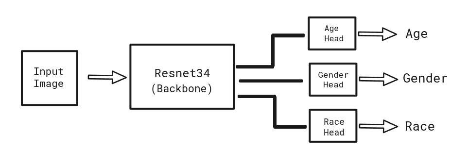

# Hydranet: Multi-Task-Learning On Facial Attribute Analysis
This project aimed to simultaneously predict age, gender, and race attributes from facial images using a single unified model. Instead of employing seperate models for individual attributes such as age, gender and race prediction, we created a single model capable of handling all three tasks simultaneously, potentially improving efficiency and reducing computational overhead using Hydranets. Facial attribute analysis is a critical area in computer vision with diverse applications, including human-computer interaction, surveillance, and biometrics. Traditionally, separate models are trained for each attribute, leading to increased complexity and computational demands. This project aims to address these limitations by exploring a single model approach for multi-task facial attribute prediction. With the rise of deep learning, multi-task learning approaches have gained traction due to their ability to jointly learn representations, enhancing the model's efficiency and generalization.  

## Network Archetecture:

### Backbone Network: 
The ResNet34 serves as the "backbone" or feature extractor in the architecture. The network processes input images and extracts the hierarchical features from the input image data. 
### Attribute-Specific Fully Connected (FC) Networks (Heads):
Following the feature extraction by ResNet34, the network diverges into three separate paths, each leading to an attribute-specific head (FC network). These heads are specialized FC networks responsible for predicting different attributes: 
#### Age Prediction Head: 
This FC network takes the extracted features and learns to predict the age of the person in the input image.
#### Gender Prediction Head:
Another FC network takes the extracted features and predicts the gender (male or female) of the person.
#### Race Prediction Head:
The third FC network predicts the race or ethnicity of the person (e.g., White, Black, Asian, Indian,  etc.).

## Loss Function: 
A combined loss function is employed to optimize the training process. We've defined the loss function as follows- 

##### <math xmlns="http://www.w3.org/1998/Math/MathML"><mi>&#x3b1;</mi></math> * AgeLoss + <math xmlns="http://www.w3.org/1998/Math/MathML"><mi>&#x3b2;</mi></math> * GenderLoss + <math xmlns="http://www.w3.org/1998/Math/MathML"><mo>&#xA0;</mo><mi>&#x3b3;</mi></math> * RaceLoss 

Where, 

AgeLoss = MeanAbsoluteError

GenderLoss = BinaryCrossEntropyLoss

RaceLoss=CrossEntropyLoss

<math xmlns="http://www.w3.org/1998/Math/MathML"><mi>&#x3b1;</mi></math> , <math xmlns="http://www.w3.org/1998/Math/MathML"><mi>&#x3b2;</mi></math> , <math xmlns="http://www.w3.org/1998/Math/MathML"><mo>&#xA0;</mo><mi>&#x3b3;</mi></math> are the importances of each task's loss. These parameters will be learned during training to control the importance of each task's loss in the overall multi-task loss function. 

## Training: 
The model is trained on UTK Face dataset. Different pre-trained neural network architectures (ResNet18, ResNet50, InceptionNet, EfficientNet) are tried as the backbone models for feature extraction from facial images. 

Tuned hyperparameters and got the optimal values for parameters -  

Bactch_size = 32

learning_rate=3e-4

L2 Regularization paramter (weight decay)=1e-5

Optimizers like Stochastic Gradient Descent (SGD), Adam are tried to adjust the network weights based on the calculated loss, Adam did a great job. 

## Results: 
Achieved gender recognition accuracy equal to 92.76 %, race prediction accuracy equal to 82.56 % , and age Mean Absolute Error equal to 4.73 years.

The achieved gender recognition accuracy of 92.76% and race prediction accuracy of 82.56% demonstrate the model's competence in distinguishing gender and ethnicity/race from facial features, respectively. The top accuracy reported on UTKFace for gender classification is around 95.5% . This was achieved by the Neighbour Learning model, which utilizes a combination of k-Nearest Neighbors and Support Vector Machines. Our model is pretty close to that. And for Race prediction, best performances are in between 80 - 90 %.  

The age Mean Absolute Error (MAE) of 4.73 years indicates the average difference between predicted and actual ages, demonstrating the model's ability to estimate ages with a reasonable level of accuracy. The current best reported MAE on UTKFace is around 4.6 years. This was achieved by the MiVOLO-D1 model based on a Densely Connected Convolutional Network (DenseNet) architecture. Our model is almost close to that.  

So, Our single model has achieved performances those attained by the best individual models specialized for each attribute (gender recognition, race prediction, and age estimation) in their respective domains. With further fine-tuning, we have the potential to enhance the model's performance even further. 

